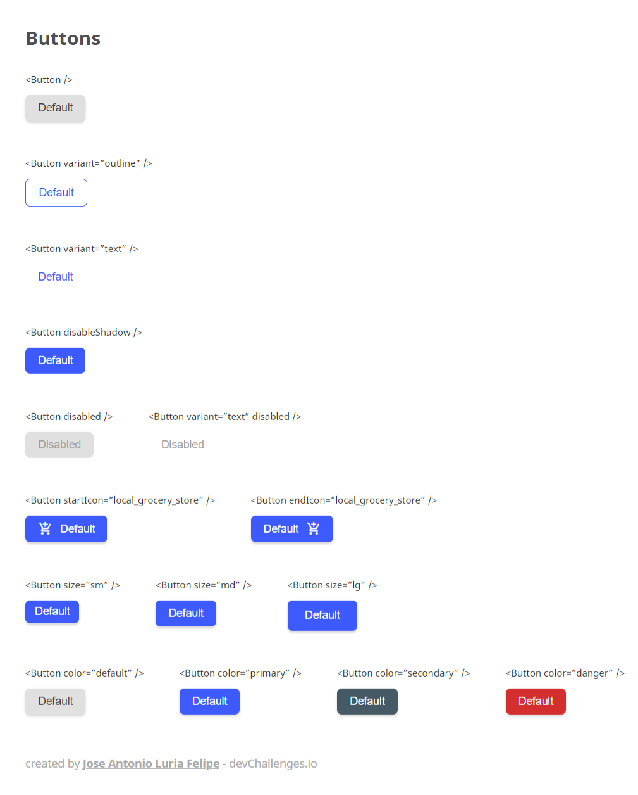

# Button Component
Solution for Button Component challenge from DevChallenges.io

## Screenshots



## Usage

Clone and run the Repository

## Installation

### First clone the repository form GitHub:
```shell
git clone https://github.com/JoseLuria/dev-challenges-button-component.git
```

### Then install the dependencies:
```shell
npm install
```

#### Finally, start the server with the following command:
```shell
npm run dev
```

## Built with 

- [React](https://reactjs.org/)
- [Vite](https://vitejs.dev/)

## License

[MIT](https://opensource.org/licenses/MIT)